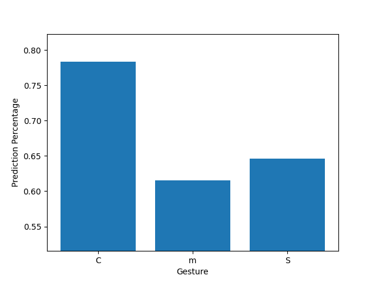

## Hand Gesture Recognition 
Screen gesture recognition refers to the process of identifying and interpreting hand or finger movements performed on a screen or touchpad. It has numerous applications, including touch-based user interfaces, virtual reality, gaming, and interactive presentations. Wondering, how it's done we have created a simple hand gesture recognition model using `Maths`, `Python` and `pygame`.

## Demo 



## How to use 
- Write the gesture on the screen using your mouse/finger. After save the gesture using the save button.
- All the gestures are saved in `gestures` folder.
- Draw a gestures and click on predict button to predict the gesture.
- You can load/ save gestures by saving them with a name you give in the text box.
- Typing in the text box and clicking on the buttons will save/ load the gestures.
- If you want to clear the screen click on the clear button.
  
## How it works
- The gestures are saved as a list of points. Each point is a tuple of (x, y) coordinates.
- The gestures are saved in a file with the name of the gesture.
- All the gestures in the `gestures` folder are loaded and stored in a dictionary.
- Using a simple formula the distance between the gesture drawn and the saved gestures are calculated.
- The gestures are predicted based on the minimum distance between the gesture drawn and the saved gestures.


## How to run the code
The project is written in `python 3.11` and uses pygame for the GUI. To run the code follow the steps below:

1. Clone the repository
```gh repo clone tarunganesh2004/Gesture_Detector```

2. Install the required packages
``` pip install -r requirements.in ```

1. Run the code
``` python main.py ```


## Further Work
-[ ] Create a better UI
-[ ] Create an ML model to predict the gestures
-[ ] Create a better gesture recognition algorithm
-[ ] Use deep learning/ AI to predict the gestures

## Requirements
- Python 3.11
- `pygame` A python library for creating GUI
- `pygame_gui` A wrapper around pygame library for creating GUI easily

## Author
- [Sri Hari](https://github.com/gtbSrihari)
- [Tarun](https://github.com/tarunganesh2004)
